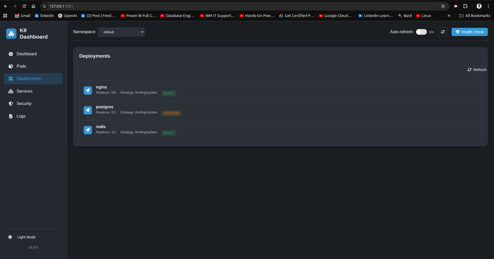

# **K8 Dashboard – Enhanced Kubernetes Monitoring & Security**

**A comprehensive Kubernetes Dashboard with real-time system monitoring, interactive visualizations, health checks, container security scanning, and dark/light theme support.**

Empower your DevOps workflow with **advanced cluster insights, security vulnerability detection, and an intuitive UI** for Kubernetes resource management.

## 📸 **Dashboard Screenshots**

### **Main Dashboard Overview**

*Real-time system metrics, cluster resources, and health status monitoring*

### **Deployments Interface**

*Deployments monitoring and management*

### **Pod Management Interface**

*Interactive pod status visualization and real-time monitoring*

### **Security Scanning Results**

*Container image vulnerability detection and reporting*

### **Log Viewer with Filtering**

*Real-time pod logs with advanced filtering capabilities*

---

## **Table of Contents**  

- [Overview](#-overview)  
- [Features](#-features)  
- [Prerequisites](#-prerequisites)  
- [Installation & Setup](#️-installation--setup)  
- [How It Works](#-how-it-works)  
- [Security & Vulnerability Scanning](#-security--vulnerability-scanning)  
- [Technology Stack](#️-technology-stack)  
- [Deployment Options](#-deployment-options)  
- [License](#-license)  
- [Support & Contributions](#-support--contributions)  

---

## **Overview**  

The **Enhanced Kubernetes Dashboard** provides a modern, feature-rich interface for **monitoring, managing, and securing your Kubernetes clusters**.

🔹 **Real-time visualizations** – Interactive charts for CPU, memory, and storage metrics  
🔹 **Comprehensive cluster view** – Monitor deployments, pods, services, and more  
🔹 **Dark/Light theme support** – Comfortable viewing in any environment  
🔹 **Security scanning with Trivy** – Detect vulnerabilities in container images  
🔹 **Pod logs viewer** – Easily access and filter container logs  
🔹 **Modern responsive UI** – Optimized for desktop and mobile devices  
🔹 **Health status monitoring** – Track cluster component health  

This dashboard enables **DevOps engineers, SREs, and developers** to efficiently manage their **Kubernetes clusters** while ensuring security best practices.  

---

## **New Features & Enhancements**

### **UI Improvements**
- **Modern dashboard layout** with sidebar navigation
- **Dark/light theme support** with system preference detection
- **Responsive design** for all device sizes
- **Interactive charts** for system metrics
- **Improved notifications system**

### **Visualization Enhancements**
- **Real-time metric charts** for CPU, memory, and storage
- **Pod status visualization** with color-coded status indicators
- **Vulnerability summary charts** for security scans
- **Historical metrics** for trend analysis

### **Functional Improvements**
- **Enhanced pod management** with detailed status information
- **Advanced log viewer** with filtering capabilities
- **Improved security scanner** with vulnerability classification
- **Health status indicators** for cluster components
- **Streamlined namespace management**

### **Security Features**
- **Detailed vulnerability reports** with severity classification
- **Export functionality** for scan results
- **Component-level health monitoring**

---

## **Prerequisites**  

Before installing the Kubernetes Dashboard, ensure you have the following dependencies installed:  

🔹 **Python 3.8+** – Required for Flask backend.  
🔹 **pip** – Python package manager.  
🔹 **Docker & Kubernetes Cluster** – To monitor cluster resources.  
🔹 **kubectl** – Kubernetes command-line tool.  
🔹 **Trivy** – For container image vulnerability scanning.  

Install **kubectl** and **Trivy** if not already installed:  

```bash
# Install kubectl (for Kubernetes resource monitoring)
curl -LO "https://dl.k8s.io/release/$(curl -L -s https://dl.k8s.io/release/stable.txt)/bin/linux/amd64/kubectl"
chmod +x kubectl
sudo mv kubectl /usr/local/bin/

# Install Trivy (for security scanning)
brew install aquasecurity/trivy/trivy  # For macOS
sudo apt install trivy  # For Ubuntu/Debian
```

---

## **Installation & Setup**  

### **Clone the Repository**  

```bash
git clone https://github.com/Edensel/k8-dashboard
cd kubernetes-dashboard
```

### **Install Python Dependencies**  

```bash
pip install -r requirements.txt
```

### **Start the Flask Application**  

```bash
python systeminfo.py
```

The dashboard is now accessible at **[http://localhost:5000](http://localhost:5000)**.  

---

## **How It Works**  

### **Real-time System Monitoring**  

- **Interactive charts** display live CPU, memory, and storage metrics
- **Historical data tracking** shows performance trends over time
- **Auto-refresh functionality** keeps data current

### **Kubernetes Resource Management**  

- **Choose a namespace** from the dropdown to filter resources
- **View deployments, pods, and services** specific to the selected namespace
- **Pod status visualization** shows running, pending, and failed pods

### **Image Security Scanning**  

- Enter a **Docker image name** (e.g., `nginx:latest`)
- Get a **comprehensive vulnerability report** with severity classifications
- **Export scan results** for documentation and compliance

### **Pod Logs Viewer**

- **Select a pod** to view its logs
- **Filter log content** to find specific information
- **Real-time log updates** for active monitoring

---

## **Security & Vulnerability Scanning**

This dashboard integrates **Trivy** to perform real-time security assessments of **Docker images**.  

### **Enhanced Security Features**  

- **Vulnerability summary** with severity counts (Critical, High, Medium, Low)  
- **Detailed vulnerability reports** with CVE information  
- **Export functionality** for documentation and compliance  
- **Visual indicators** for security status  

### **Running a Scan**  

1. Enter the Docker image name in the scan form
2. Click the Scan button
3. View the vulnerability summary and detailed report
4. Export results if needed

---

## **Technology Stack**  

| **Component**        | **Technology**             |
|----------------------|---------------------------|
| **Frontend**         | HTML5, CSS3, JavaScript ES6 |
| **UI Framework**     | Custom CSS with Flexbox/Grid |
| **Charts**           | Chart.js                  |
| **Backend**          | Python Flask              |
| **Kubernetes API**   | Python Kubernetes Client  |
| **Security Scanning**| Trivy                     |
| **Deployment**       | Docker, Kubernetes        |

---

## **Deployment Options**  

You can deploy the Kubernetes Dashboard using **Docker, Kubernetes, or a cloud platform**.  

### 🔹 **Run with Docker**  

```bash
docker build -t kubernetes-dashboard .
docker run -p 5000:5000 kubernetes-dashboard
```

### 🔹 **Deploy on Kubernetes**  

```bash
kubectl apply -f k8s-manifest.yaml
```

### 🔹 **Deploy on Cloud (AWS/GCP/Azure)**

You can deploy the dashboard on a **Kubernetes cluster** running on AWS EKS, GCP GKE, or Azure AKS.

### 🔹 **Deploy Frontend to Netlify**

**Important Note:** Netlify is designed for static sites. You'll need to deploy the **Flask backend** to a Python-compatible service (Heroku, Railway, Render) and the **frontend** to Netlify.

#### **Step 1: Deploy Backend to Heroku/Railway**
```bash
# For Heroku
heroku create your-k8-dashboard-backend
heroku config:set FLASK_DEBUG=False
git push heroku main

# For Railway - connect your GitHub repo
# Railway will auto-detect Python/Flask
```

#### **Step 2: Deploy Frontend to Netlify**
1. **Go to [Netlify.com](https://netlify.com)**
2. **Click "New site from Git"**
3. **Connect your GitHub repository**
4. **Configure build settings:**
   ```yaml
   Build command: sed -i 's|http://127.0.0.1:5002|'$API_BASE_URL'|g' index.html app.js
   Publish directory: .
   ```
5. **Add environment variable:**
   ```
   API_BASE_URL = https://your-backend-url.herokuapp.com
   ```
6. **Click "Deploy site"**

#### **Step 3: Alternative Manual Upload**
1. **Go to Netlify Sites**
2. **Click "Deploy manually"**
3. **Drag and drop all project files**
4. **Site will be live immediately**

#### **Step 4: Configure API Connection**
Update the `API_BASE_URL` in your Netlify environment variables to point to your backend:
```
API_BASE_URL = https://your-heroku-app.herokuapp.com
```

#### **Step 5: Test Your Deployment**
- **Frontend:** Visit your Netlify URL
- **API Connection:** Check browser console for successful API calls
- **All Features:** Test navigation, charts, logs, and security scanning

---

## **Support & Contributions**

Contributions are welcome! If you'd like to improve this project, feel free to submit a pull request.  

---

## **License**  

This project is licensed under the **MIT License** – free for personal and commercial use.  

---